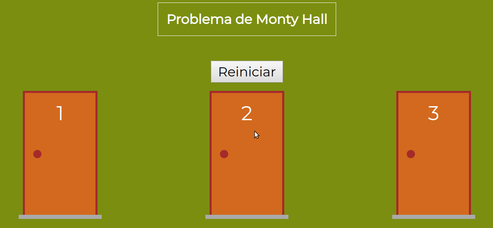

# Problema de Montyhall

---

[]
>Este projeto foi criado a partir do mini curso de Vue disponibilizado no Youtube pela [COD3R Cursos](https://www.cod3r.com.br/portal).
---

## Origem do jogo

O Paradoxo de Monty Hall é um problema matemático que surgiu a partir de um programa de TV chamado Let’s Make a Deal, que era exibido nos EUA. O vídeo acima talvez contenha a melhor explicação disponível para ele. O problema é simples. Você está em um jogo em um programa de TV, e precisa escolher uma entre três portas: por trás de uma está um carro, e nas duas outras, cabras. Você escolhe um delas – digamos, a número 1 – e o apresentador (que sabe o que está por trás de cada uma delas) abre outra porta – digamos a número 3 – que tem uma cabra por trás. Você então tem a opção de continuar com a que escolheu, ou mudar para a outra – a número 2, no nosso exemplo.
A questão é: você deve mudar a sua escolha? A resposta é ao mesmo tempo incrivelmente simples e diabolicamente contraditória: a melhor estratégia é mudar de porta. Quando você escolhe a primeira porta, a probabilidade de ganhar o carro por ela é de 1/3. As outras duas, em conjunto, tem 2/3 de probabilidade de conter o carro. Quando a porta com a cabra é aberta e eliminada, você fica com duas opções: uma com 1/3 de ter o carro, e outra com 2/3. Portanto, mudar de porta é sempre a melhor opção, e a sua chance de ganhar dobra de 1/3 para 2/3. Não significa que você ganhará o carro com certeza ao trocar de porta. Mas, se jogar diversas vezes e sempre escolher por trocar de porta, suas chances de ficar com o prêmio são bem maiores do que quando você mantém a primeira porta escolhida.

## Como rodar

Para iniciar o servidor e abrir o jogo, basta entrar na pasta com o terminal e digitar

`npm run serve`

## Tecnologias

- VUE.JS
- HTML5
- JAVASCRIPT
- CSS3